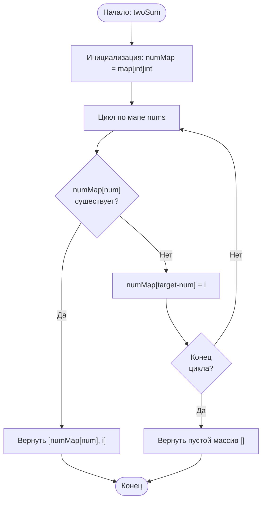

## 1. [Сумма двух чисел (Two Sum)](https://leetcode.com/problems/two-sum/description/)

**Сложность:** Простая

---

### Описание задачи:

Дан массив целых чисел `nums` и целое число `target`. Верните **индексы** двух чисел из массива `nums` таких, что их сумма равна `target`.

Вы можете предполагать, что каждый входной набор данных имеет **ровно одно решение**, и вы **не можете** использовать один и тот же элемент дважды.

Вы можете вернуть ответ в любом порядке.

---

### Примеры:

**Пример 1:**
*   **Вход:** `nums` = [2, 7, 11, 15], `target` = 9
*   **Выход:** [0, 1]
*   **Пояснение:** Потому что `nums[0] + nums[1] == 9`, мы возвращаем `[0, 1]`.

**Пример 2:**
*   **Вход:** `nums` = [3, 2, 4], `target` = 6
*   **Выход:** [1, 2]

**Пример 3:**
*   **Вход:** `nums` = [3, 3], `target` = 6
*   **Выход:** [0, 1]

---

### Ограничения:

*   `2 <= nums.length <= 10^4` (Длина массива от 2 до 10,000)
*   `-10^9 <= nums[i] <= 10^9` (Значение каждого элемента от -1,000,000,000 до 1,000,000,000)
*   `-10^9 <= target <= 10^9` (Значение `target` от -1,000,000,000 до 1,000,000,000)
*   **Существует только одно верное решение.**

---

### Дополнительный вопрос (Follow-up):

Можете ли вы придумать алгоритм, временная сложность которого меньше, чем O(n²)?

