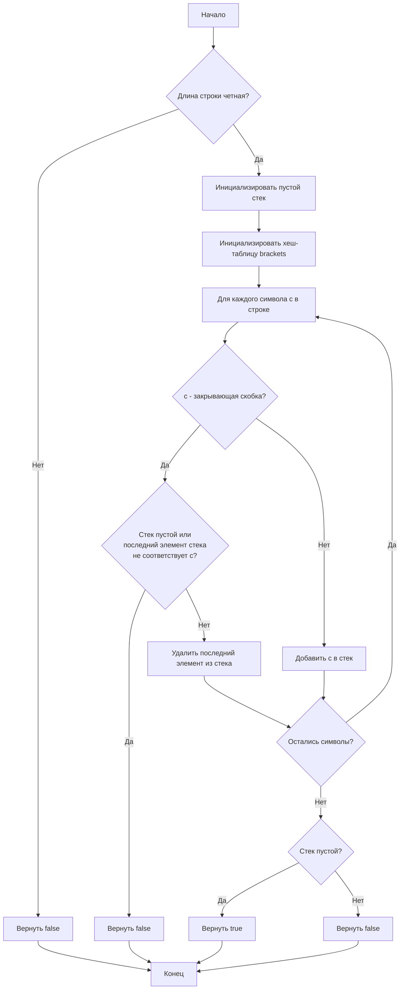

# [Валидные скобки (Valid Parentheses)](https://leetcode.com/problems/valid-parentheses/description/)

Дана строка `s`, содержащая только символы '(', ')', '{', '}', '[' и ']', определите, является ли входная строка допустимой.

Входная строка считается допустимой, если:

1. Открывающие скобки должны быть закрыты скобками того же типа.
2. Открывающие скобки должны быть закрыты в правильном порядке.
3. Каждая закрывающая скобка имеет соответствующую открывающую скобку того же типа.

**Пример 1:**
```
Вход: s = "()"
Выход: true
```

**Пример 2:**
```
Вход: s = "()[]{}"
Выход: true
```

**Пример 3:**
```
Вход: s = "(]"
Выход: false
```

**Пример 4:**
```
Вход: s = "([)]"
Выход: true
```

**Ограничения:**
* 1 ≤ s.length ≤ 10⁴
* s состоит только из скобок '()[]{}'

