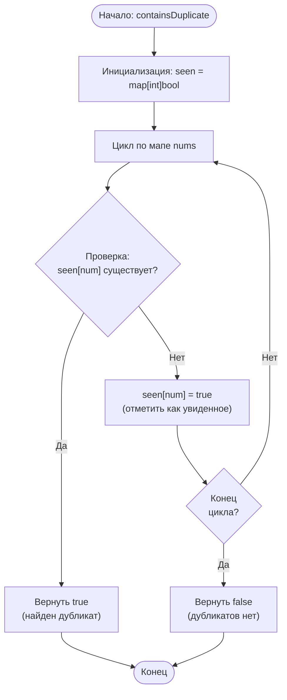

## 217. [Содержит дубликат(Contains Duplicate)](https://leetcode.com/problems/contains-duplicate/)

**Сложность:** Простая

---

### Описание задачи:

Дан целочисленный массив `nums`. Верните `true`, если какое-либо значение встречается в массиве **хотя бы два раза**, и `false`, если все элементы массива уникальны.

---

### Примеры:

**Пример 1:**
*   **Вход:** `nums` = [1,2,3,1]
*   **Выход:** `true`
*   **Пояснение:** Элемент `1` встречается по индексам 0 и 3.

**Пример 2:**
*   **Вход:** `nums` = [1,2,3,4]
*   **Выход:** `false`
*   **Пояснение:** Все элементы уникальны.

**Пример 3:**
*   **Вход:** `nums` = [1,1,1,3,3,4,3,2,4,2]
*   **Выход:** `true`

---

### Ограничения:

*   `1 ≤ nums.length ≤ 10⁵` (Длина массива от 1 до 100,000)
*   `-10⁹ ≤ nums[i] ≤ 10⁹` (Значение каждого элемента от -1,000,000,000 до 1,000,000,000)

