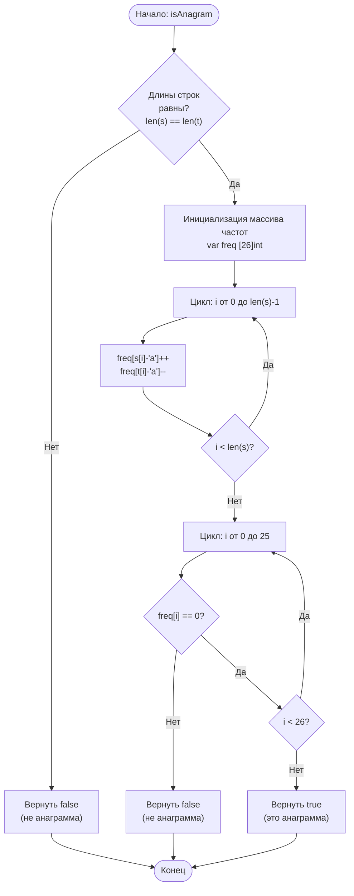

## 242. Корректная анаграмма (Valid Anagram)

**Сложность:** Простая

---

### Описание задачи:

Даны две строки `s` и `t`. Верните `true`, если строка `t` является анаграммой строки `s`, и `false` в противном случае.

*Анаграмма* — это слово или фраза, образованные путём перестановки букв другого слова или фразы, обычно с использованием всех исходных букв ровно один раз.

---

### Примеры:

**Пример 1:**
*   **Вход:** `s = "anagram"`, `t = "nagaram"`
*   **Выход:** `true`

**Пример 2:**
*   **Вход:** `s = "rat"`, `t = "car"`
*   **Выход:** `false`

---

### Ограничения:

*   `1 <= s.length, t.length <= 5 * 10^4` (Длина строк от 1 до 50,000)
*   `s` и `t` состоят только из строчных английских букв.

---

