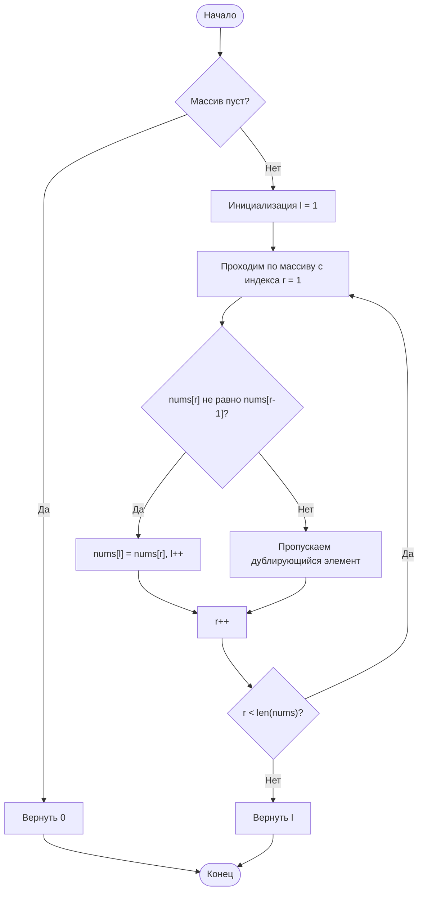

# 26. [Удаление дубликатов из отсортированного массива (Remove Duplicates from Sorted Array)](https://leetcode.com/problems/remove-duplicates-from-sorted-array/description/)

**Сложность:** Легкая

## Условие задачи

Дан целочисленный массив `nums`, отсортированный в **неубывающем порядке**. Требуется удалить дубликаты **на месте** так, чтобы каждый уникальный элемент появлялся только **один раз**. **Относительный порядок** элементов должен быть сохранен. Затем вернуть количество уникальных элементов в `nums`.

Рассмотрим количество уникальных элементов в `nums` как `k`. Чтобы решение было принято, необходимо сделать следующее:

* Изменить массив `nums` так, чтобы первые `k` элементов содержали уникальные элементы в том порядке, в котором они изначально присутствовали в `nums`. Оставшиеся элементы не важны, как и размер `nums`.
* Вернуть `k`.

## Пользовательский судья:

Судья будет тестировать ваше решение следующим кодом:

```
int[] nums = [...]; // Входной массив
int[] expectedNums = [...]; // Ожидаемый ответ с правильной длиной

int k = removeDuplicates(nums); // Вызов вашей реализации

assert k == expectedNums.length;
for (int i = 0; i < k; i++) {
    assert nums[i] == expectedNums[i];
}
```

Если все проверки пройдены, то ваше решение будет **принято**.

## Пример 1:

**Ввод:** nums = [1,1,2]  
**Вывод:** 2, nums = [1,2,_]  
**Объяснение:** Ваша функция должна вернуть k = 2, при этом первые два элемента nums должны быть 1 и 2 соответственно. Не имеет значения, что вы оставляете после возвращаемого k (поэтому они подчеркнуты).

## Пример 2:

**Ввод:** nums = [0,0,1,1,1,2,2,3,3,4]  
**Вывод:** 5, nums = [0,1,2,3,4,_,_,_,_,_]  
**Объяснение:** Ваша функция должна вернуть k = 5, при этом первые пять элементов nums должны быть 0, 1, 2, 3 и 4 соответственно. Не имеет значения, что вы оставляете после возвращаемого k (поэтому они подчеркнуты).

## Ограничения:

* 1 ≤ nums.length ≤ 3 * 10⁴
* -100 ≤ nums[i] ≤ 100
* Массив `nums` отсортирован в неубывающем порядке.

