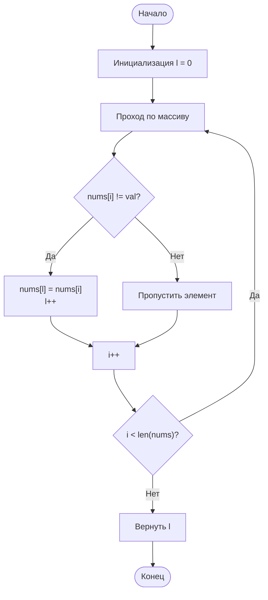

# 27. [Удаление элемента (Remove Element)](https://leetcode.com/problems/remove-element/description/)

**Сложность:** Легкая

## Условие задачи

Дан целочисленный массив `nums` и целое число `val`. Требуется удалить все вхождения `val` в `nums` **на месте**. Порядок элементов может быть изменен. Затем необходимо вернуть количество элементов в `nums`, которые не равны `val`.

Рассмотрим количество элементов в `nums`, которые не равны `val`, как `k`. Чтобы решение было принято, необходимо сделать следующее:

* Изменить массив `nums` так, чтобы первые `k` элементов содержали элементы, которые не равны `val`. Оставшиеся элементы не важны, как и размер `nums`.
* Вернуть `k`.

## Пользовательский судья:

Судья будет тестировать ваше решение следующим кодом:

```
int[] nums = [...]; // Входной массив
int val = ...; // Значение для удаления
int[] expectedNums = [...]; // Ожидаемый ответ с правильной длиной.
                           // Отсортирован без элементов, равных val.

int k = removeElement(nums, val); // Вызов вашей реализации

assert k == expectedNums.length;
sort(nums, 0, k); // Сортировка первых k элементов массива
for (int i = 0; i < actualLength; i++) {
    assert nums[i] == expectedNums[i];
}
```

Если все проверки пройдены, то ваше решение будет **принято**.

```
Пример 1:

Input: nums = [3,2,2,3], val = 3
Output: 2, nums = [2,2,_,_]
Explanation: Your function should return k = 2, with the first two elements of nums being 2.
It does not matter what you leave beyond the returned k (hence they are underscores).

Пример 2:

Input: nums = [0,1,2,2,3,0,4,2], val = 2
Output: 5, nums = [0,1,4,0,3,_,_,_]
Explanation: Your function should return k = 5, with the first five elements of nums containing 0, 0, 1, 3, and 4.
Note that the five elements can be returned in any order.
It does not matter what you leave beyond the returned k (hence they are underscores).
```

## Ограничения:

* 0 ≤ nums.length ≤ 100
* 0 ≤ nums[i] ≤ 50
* 0 ≤ val ≤ 100

