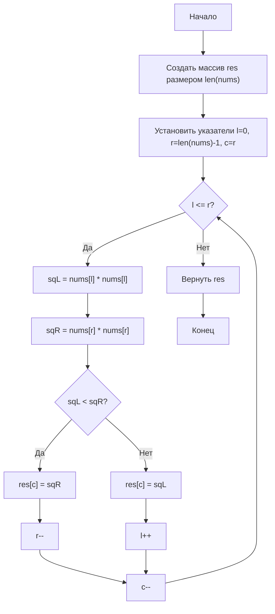

# 977. [Квадраты отсортированного массива (Squares of a Sorted Array)](https://leetcode.com/problems/squares-of-a-sorted-array/)

**Сложность:** Легкая

**Категории:** Массивы, Сортировка

## Условие задачи

Дан целочисленный массив `nums`, отсортированный в порядке **неубывания**, верните массив квадратов каждого числа, отсортированный в порядке неубывания.

## Пример 1:

**Ввод:** nums = [-4,-1,0,3,10]  
**Вывод:** [0,1,9,16,100]  
**Объяснение:** После возведения в квадрат массив становится [16,1,0,9,100].  
После сортировки, он становится [0,1,9,16,100].

## Пример 2:

**Ввод:** nums = [-7,-3,2,3,11]  
**Вывод:** [4,9,9,49,121]

## Ограничения:

* 1 <= nums.length <= 10^4
* -10^4 <= nums[i] <= 10^4
* `nums` отсортирован в порядке **неубывания**.

## Дополнительный вопрос:
Возведение в квадрат каждого элемента и сортировка нового массива — это тривиальное решение, можете ли вы найти решение со сложностью O(n), используя другой подход?

