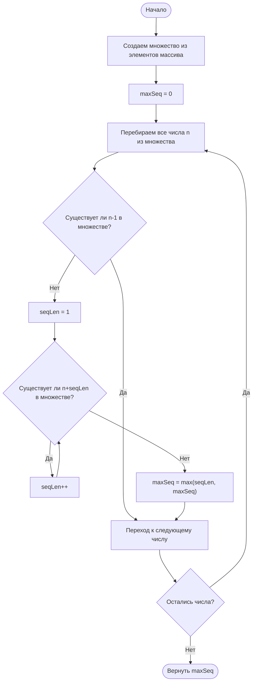

## 128. [Самая длинная последовательность (Longest Consecutive Sequence)](https://leetcode.com/problems/longest-consecutive-sequence/)

**Сложность:** Средняя

---

### Описание задачи:

Дан несортированный массив целых чисел `nums`. Верните длину самой длинной последовательности подряд идущих элементов.

Вы должны написать алгоритм, который работает за время **O(n)**.

---

### Примеры:

**Пример 1:**
*   **Вход:** `nums` = [100, 4, 200, 1, 3, 2]
*   **Выход:** 4
*   **Пояснение:** Самая длинная последовательность подряд идущих элементов - это [1, 2, 3, 4]. Её длина равна 4.

**Пример 2:**
*   **Вход:** `nums` = [0, 3, 7, 2, 5, 8, 4, 6, 0, 1]
*   **Выход:** 9
*   **Пояснение:** Самая длинная последовательность - [0, 1, 2, 3, 4, 5, 6, 7, 8]. Её длина равна 9.

**Пример 3:**
*   **Вход:** `nums` = [1, 0, 1, 2]
*   **Выход:** 3
*   **Пояснение:** Самая длинная последовательность - [0, 1, 2]. Её длина равна 3.

---

### Ограничения:

*   `0 <= nums.length <= 10^5` (Длина массива от 0 до 100,000)
*   `-10^9 <= nums[i] <= 10^9` (Значение каждого элемента от -1,000,000,000 до 1,000,000,000)

