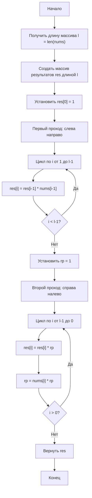

## 238. [Произведение массива кроме себя (Product of Array Except Self)](https://leetcode.com/problems/product-of-array-except-self/description/)

**Сложность:** Средняя

---

### Описание задачи:

Дан целочисленный массив `nums`. Верните массив `answer` такой, что `answer[i]` равен произведению всех элементов `nums`, **кроме** `nums[i]`.

Гарантируется, что произведение любого префикса или суффикса массива `nums` помещается в **32-битное** целое число.

Вы должны написать алгоритм, который работает за время **O(n)** и **не использует** операцию деления.

---

### Примеры:

**Пример 1:**
*   **Вход:** `nums` = [1, 2, 3, 4]
*   **Выход:** `answer` = [24, 12, 8, 6]
    *   `answer[0]` = 2 * 3 * 4 = 24
    *   `answer[1]` = 1 * 3 * 4 = 12
    *   `answer[2]` = 1 * 2 * 4 = 8
    *   `answer[3]` = 1 * 2 * 3 = 6

**Пример 2:**
*   **Вход:** `nums` = [-1, 1, 0, -3, 3]
*   **Выход:** `answer` = [0, 0, 9, 0, 0]

---

### Ограничения:

*   `2 ≤ nums.length ≤ 10⁵` (Длина массива от 2 до 100,000)
*   `-30 ≤ nums[i] ≤ 30` (Значение каждого элемента от -30 до 30)
*   Входные данные сгенерированы таким образом, что `answer[i]` гарантированно помещается в **32-битное** целое число.

---

### Дополнительный вопрос (Follow up):

Можете ли вы решить задачу с **O(1)** дополнительной пространственной сложностью? (Выходной массив `answer` **не считается** как дополнительное пространство при анализе пространственной сложности.)

