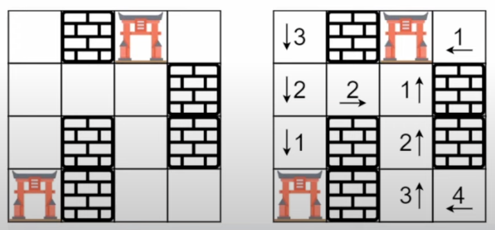

https://leetcode.com/problems/walls-and-gates/description/
286. Стены и Ворота (Walls and Gates)

`Medium`

Вам дана сетка `rooms` размером `m x n`, инициализированная тремя возможными значениями:
*   `-1` Стена или препятствие.
*   `0` Ворота.
*   `INF` Бесконечность означает пустую комнату. Мы используем значение 2³¹ - 1 = `2147483647` для представления `INF`, так как можно предположить, что расстояние до ворот меньше `2147483647`.

Заполните каждую пустую комнату расстоянием до ее *ближайших* ворот. Если невозможно добраться до ворот, она должна быть заполнена `INF`.

**Пример 1:**\

```
Input: rooms = [[2147483647,-1,0,2147483647],[2147483647,2147483647,2147483647,-1],[2147483647,-1,2147483647,-1],[0,-1,2147483647,2147483647]]
Output: [[3,-1,0,1],[2,2,1,-1],[1,-1,2,-1],[0,-1,3,4]]
```