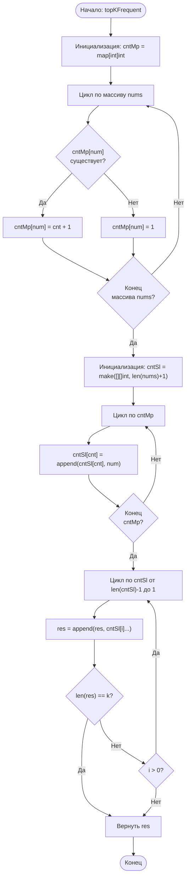

## 347. Топ K частых элементов (Top K Frequent Elements)

**Сложность:** Средняя

---

### Описание задачи:

Дан целочисленный массив `nums` и целое число `k`. Верните `k` наиболее часто встречающихся элементов. Вы можете вернуть ответ в любом порядке.

---

### Примеры:

**Пример 1:**
*   **Вход:** `nums` = [1,1,1,2,2,3], `k` = 2
*   **Выход:** [1, 2]

**Пример 2:**
*   **Вход:** `nums` = [1], `k` = 1
*   **Выход:** [1]

---

### Ограничения:

*   `1 <= nums.length <= 10^5` (Длина массива от 1 до 100,000)
*   `-10^4 <= nums[i] <= 10^4` (Значение каждого элемента от -10,000 до 10,000)
*   `k` находится в диапазоне [1, количество уникальных элементов в массиве].
*   Гарантируется, что ответ **уникален**.

---

### Дополнительный вопрос (Follow up):

Временная сложность вашего алгоритма должна быть **лучше**, чем O(n log n), где n — размер массива.

