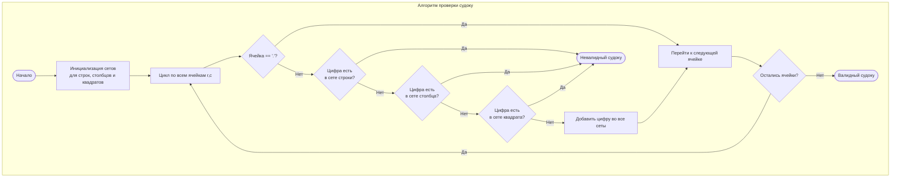

## 36. Корректный Судоку (Valid Sudoku)

**Сложность:** Средняя

---

### Описание задачи:

Определите, является ли доска Судоку размером 9x9 **корректной**. Необходимо проверить только **заполненные** ячейки согласно следующим правилам:

1.  Каждая строка должна содержать цифры **1-9** без повторений.
2.  Каждый столбец должен содержать цифры **1-9** без повторений.
3.  Каждый из девяти под-квадратов сетки размером **3x3** должен содержать цифры **1-9** без повторений.

**Примечание:**

*   Доска Судоку (частично заполненная) может быть корректной, но не обязательно решаемой.
*   Проверять нужно только заполненные ячейки в соответствии с упомянутыми правилами.

---

### Примеры:

**Пример 1:**


*(Примечание: Это изображение из оригинального описания задачи)*

*   **Вход:** `board` =
    ```
    [["5","3",".",".","7",".",".",".","."]
    ,["6",".",".","1","9","5",".",".","."]
    ,[".","9","8",".",".",".",".","6","."]
    ,["8",".",".",".","6",".",".",".","3"]
    ,["4",".",".","8",".","3",".",".","1"]
    ,["7",".",".",".","2",".",".",".","6"]
    ,[".","6",".",".",".",".","2","8","."]
    ,[".",".",".","4","1","9",".",".","5"]
    ,[".",".",".",".","8",".",".","7","9"]]
    ```
*   **Выход:** `true`

**Пример 2:**

*   **Вход:** `board` =
    ```
    [["8","3",".",".","7",".",".",".","."]
    ,["6",".",".","1","9","5",".",".","."]
    ,[".","9","8",".",".",".",".","6","."]
    ,["8",".",".",".","6",".",".",".","3"]
    ,["4",".",".","8",".","3",".",".","1"]
    ,["7",".",".",".","2",".",".",".","6"]
    ,[".","6",".",".",".",".","2","8","."]
    ,[".",".",".","4","1","9",".",".","5"]
    ,[".",".",".",".","8",".",".","7","9"]]
    ```
*   **Выход:** `false`
*   **Пояснение:** То же, что и в Примере 1, за исключением того, что 5 в левом верхнем углу заменена на 8. Поскольку в левом верхнем под-квадрате 3x3 есть две цифры 8, доска невалидна.

---

### Ограничения:

*   `board.length == 9` (В доске ровно 9 строк)
*   `board[i].length == 9` (В каждой строке ровно 9 столбцов)
*   `board[i][j]` является цифрой **'1'-'9'** или символом **'.'**.

