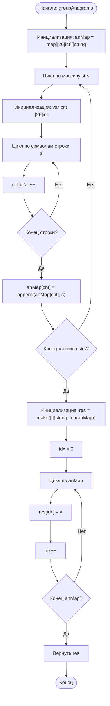

## 49. Группировка анаграмм (Group Anagrams)

**Сложность:** Средняя

---

### Описание задачи:

Дан массив строк `strs`. Сгруппируйте **анаграммы** вместе. Вы можете вернуть ответ в любом порядке.

*Анаграмма* — это слово или фраза, образованные путём перестановки букв другого слова или фразы, обычно с использованием всех исходных букв ровно один раз.

---

### Примеры:

**Пример 1:**
*   **Вход:** `strs` = ["eat", "tea", "tan", "ate", "nat", "bat"]
*   **Выход:** [["bat"], ["nat", "tan"], ["ate", "eat", "tea"]]
*   **Пояснение:**
    *   Нет строки в `strs`, которая может быть переставлена для образования "bat".
    *   Строки "nat" и "tan" являются анаграммами, так как их можно получить друг из друга перестановкой букв.
    *   Строки "ate", "eat" и "tea" являются анаграммами, так как их можно получить друг из друга перестановкой букв.

**Пример 2:**
*   **Вход:** `strs` = [""]
*   **Выход:** [[""]]

**Пример 3:**
*   **Вход:** `strs` = ["a"]
*   **Выход:** [["a"]]

---

### Ограничения:

*   `1 <= strs.length <= 10^4` (Длина массива строк от 1 до 10,000)
*   `0 <= strs[i].length <= 100` (Длина каждой строки от 0 до 100)
*   `strs[i]` состоит только из строчных английских букв.

