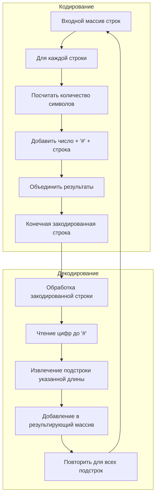

## Кодирование и декодирование строк (Encode and Decode Strings)

**Сложность:** Средняя

---

### Описание задачи:

Разработайте алгоритм для кодирования списка строк в одну строку. Закодированная строка затем декодируется обратно в исходный список строк.

Пожалуйста, реализуйте функции `encode` и `decode`.

---

### Примеры:

**Пример 1:**
*   **Вход:** `["neet", "code", "love", "you"]`
*   **Выход (после encode -> decode):** `["neet", "code", "love", "you"]`

**Пример 2:**
*   **Вход:** `["we", "say", ":", "yes"]`
*   **Выход (после encode -> decode):** `["we", "say", ":", "yes"]`

---

### Ограничения:

*   `0 <= strs.length < 100` (Количество строк в списке от 0 до 99)
*   `0 <= strs[i].length < 200` (Длина каждой строки от 0 до 199)
*   `strs[i]` содержит только **UTF-8** символы.

---

### ▼ Рекомендуемая временная и пространственная сложность

Вам следует стремиться к решению с временной сложностью **O(m)** для каждого вызова `encode()` и `decode()` и пространственной сложностью **O(m + n)**, где:
*   `m` - это сумма длин всех строк.
*   `n` - это количество строк.

